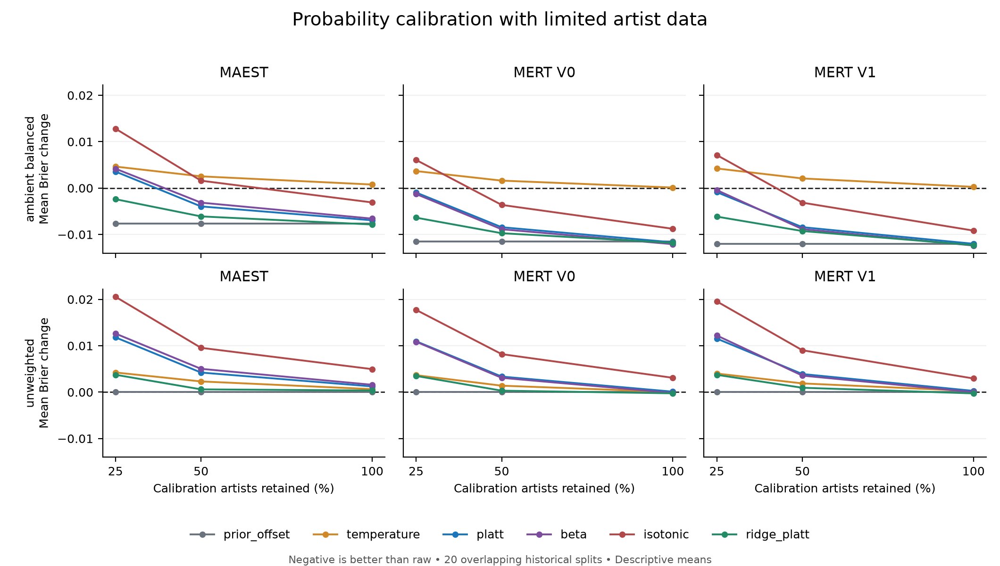

# 第一轮：数据少的时候，怎样避免把概率调坏？

独立项目已完成第一轮探索实验。这里沿用旧研究中已经计算好的音乐模型分数，
研究怎样把这些分数调整得更可信。**没有修改已经发布的音乐分类应用。**

最清楚的结果是：**让校准器受到约束、必要时保留原分数，比放手调整更稳妥；
但即使这样，校准也不保证比原始输出更好。** 这里的“更稳妥”指本轮配对误差
比较，不是对未来歌曲的保证。

## 做了什么

数据来自已经使用过的1,206首歌、469位艺人。沿用20组历史划分、3种音频表征、
2种训练权重设置；每组分别拿25%、50%、100%的校准艺人来调整概率。
合计360组数据条件，每组比较7种方法，共2,520个方法与条件组合。
同一位艺人不会同时出现在一组实验的训练、校准和评分部分。

七种方法包括不调整、按训练权重作简单修正、温度缩放、普通Platt校准、Beta校准、
保序回归，以及本轮重点比较的“限制调整幅度、用交叉验证选择力度”的Platt校准。
这些都是已有方法或现有思路的组合，本项目不声称发明了新的校准原理。

“限制调整幅度”可以理解为：先假设原分数值得保留，只有校准样本支持时才明显改变。
程序可以选择完全不改；选择过程只看校准组，不偷看最后的评分组答案。

## 主要发现

1. **小预算下，灵活校准更容易让评分误差上升。** 这种现象与小样本过拟合风险一致，
   但本轮没有单独识别原因；校准组和评分组的组成差异也可能有影响。在MAEST、不使用类别加权、只用25%校准
   艺人的条件下，普通Platt校准的20组结果都比原始分数差；Beta和保序回归也都变差。
   这相当于校正温度计时只观察了少数天气，学到的规则反而不适合其他天气。
2. **限制调整幅度有帮助，但没有消除问题。** 在3种表征×2种权重×3种预算构成的
   18个条件中，受约束方法的平均Brier误差都低于普通Platt。但小预算、不加权条件下，
   三种表征的平均误差仍高于不调整。不能把“比普通校准好”说成“校准一定有用”。
3. **更多校准数据有帮助，但仍有条件。** 全预算时，不加权的两个MERT版本在受约束
   方法下出现轻微平均改善，MAEST仍轻微变差。加权条件下，简单的训练权重偏移修正
   也是很强的对照，因此不能把所有校准收益都归功于复杂的方法。

下面以MAEST为例，数字表示相对于原始分数的Brier误差变化；**负数是改善，正数是变差**。
这些数字不是准确率，也不是百分点。

| 训练设置 | 校准艺人比例 | 普通Platt | 受约束的Platt |
|---|---:|---:|---:|
| 氛围标签加权 | 25% | +0.003561 | -0.002395 |
| 氛围标签加权 | 50% | -0.003953 | -0.006106 |
| 氛围标签加权 | 100% | -0.006941 | -0.007849 |
| 全部不加权 | 25% | +0.011812 | +0.003745 |
| 全部不加权 | 50% | +0.004223 | +0.000601 |
| 全部不加权 | 100% | +0.001235 | +0.000351 |

每条线是20组历史划分的平均值。它们反复使用同一批歌曲，因此不是20份独立数据，
也不能把这些曲线当作置信区间。每个划分只取一组嵌套的艺人子集，没有估计同一
划分内反复抽取校准样本的全部波动。

## 核查与失败记录

360组实验均保留，没有丢弃表现差的组，也没有重抽到满意为止。
最终校准器没有出现回退；内部交叉验证中记录了134次回退：120次因训练部分只含
一种标签结果，14次因优化器未收敛。被选中力度对应的内部回退共19次。
回退按预先固定的规则保留原始分数，并计入比较，没有隐瞒成正常拟合。

Beta校准有648/1,440次最终逐标签拟合触及预设参数边界。这些结果都保留了；
比较针对本研究的有界实现，不能推断所有Beta校准实现都会得到相同结果。

1,440次逐标签力度选择中，761次选择完全保留原始分数。其余选择不同程度的调整。
该次数属于本实验的诊断记录，不能解释为未来应该有多少比例的标签不校准。

独立数值核查已通过：旧方法全预算预测复现、数据对齐、艺人隔离、参数重建、
内部交叉验证选择、概率指标和最终汇总均通过。最大绝对数值差约2.22×10⁻¹⁶。
这些检查说明计算一致，不等于科学结论已经被外部独立验证。

另外，新建环境重新安装依赖后，38项测试通过，360组实验全部重跑；7份数值报告
与首轮逐字节一致。详见[复现记录](reproduction.json)。这仍是同一台机器、同一批
数据上的计算复现，不是外部独立研究。

## 接下来研究什么

下一阶段应先固定一个待验证的规则和通过标准，再在没有参与选择的新歌曲上检验。
全部历史样本和已经查看过的候选采样范围都进入排除名单：2,835首歌、1,296个艺人ID。
不能将旧歌换个目录后重新当作未知测试集。

目前仍依赖同一数据源的已有标签；这些标签可能遗漏或存在争议。艺人别名和音频
大模型预训练是否接触过这些歌，也没有完全查清。跨数据源或独立标注的验证会更有
说服力，但本轮没有据此声称模型已能给任何歌曲提供可靠置信度，也没有声称可以发表。

完整数值见[英文报告](REPORT.md)、[全部分组汇总](summary_cells.csv)和
[核查记录](verification.json)。
