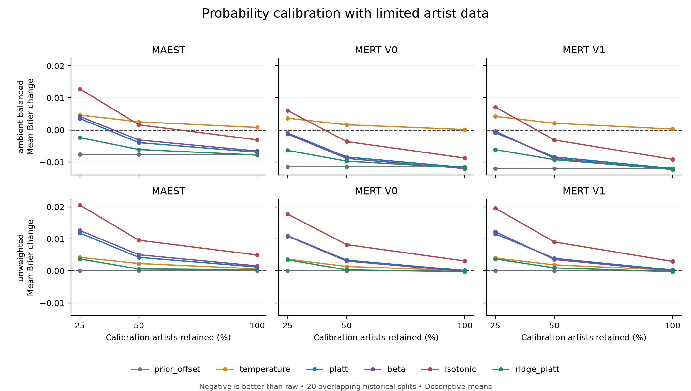

# Limited-data calibration benchmark

All 360 planned cases are retained: 20 historical artist splits × 3 representations ×
2 training-weight settings × 3 calibration budgets. Seven probability treatments
are compared on the same evaluation rows within each split. The 1,206 songs /
469 artists have been used in earlier research; these results are exploratory.

Negative changes mean lower probability error than raw scores. Each plotted mean
uses 20 overlapping historical splits; the lines are not confidence intervals.

## Full calibration budget

| Representation | Ambient weighting | Method | Mean Brier | Change vs raw | Better / 20 |
|---|---|---|---:|---:|---:|
| maest | ambient_balanced | beta | 0.133863 | -0.006580 | 20 |
| maest | ambient_balanced | isotonic | 0.137347 | -0.003097 | 17 |
| maest | ambient_balanced | platt | 0.133502 | -0.006941 | 20 |
| maest | ambient_balanced | prior_offset | 0.132749 | -0.007695 | 20 |
| maest | ambient_balanced | raw | 0.140444 | +0.000000 | 0 |
| maest | ambient_balanced | ridge_platt | 0.132595 | -0.007849 | 20 |
| maest | ambient_balanced | temperature | 0.141209 | +0.000765 | 2 |
| maest | unweighted | beta | 0.133735 | +0.001575 | 4 |
| maest | unweighted | isotonic | 0.137119 | +0.004959 | 0 |
| maest | unweighted | platt | 0.133395 | +0.001235 | 4 |
| maest | unweighted | prior_offset | 0.132160 | +0.000000 | 0 |
| maest | unweighted | raw | 0.132160 | +0.000000 | 0 |
| maest | unweighted | ridge_platt | 0.132510 | +0.000351 | 4 |
| maest | unweighted | temperature | 0.132807 | +0.000647 | 2 |
| mert_v0 | ambient_balanced | beta | 0.143657 | -0.012090 | 20 |
| mert_v0 | ambient_balanced | isotonic | 0.146974 | -0.008772 | 19 |
| mert_v0 | ambient_balanced | platt | 0.144058 | -0.011689 | 20 |
| mert_v0 | ambient_balanced | prior_offset | 0.144222 | -0.011525 | 20 |
| mert_v0 | ambient_balanced | raw | 0.155747 | +0.000000 | 0 |
| mert_v0 | ambient_balanced | ridge_platt | 0.143938 | -0.011809 | 20 |
| mert_v0 | ambient_balanced | temperature | 0.155861 | +0.000115 | 11 |
| mert_v0 | unweighted | beta | 0.143825 | -0.000169 | 11 |
| mert_v0 | unweighted | isotonic | 0.147084 | +0.003090 | 3 |
| mert_v0 | unweighted | platt | 0.144097 | +0.000103 | 11 |
| mert_v0 | unweighted | prior_offset | 0.143994 | +0.000000 | 0 |
| mert_v0 | unweighted | raw | 0.143994 | +0.000000 | 0 |
| mert_v0 | unweighted | ridge_platt | 0.143742 | -0.000252 | 12 |
| mert_v0 | unweighted | temperature | 0.144027 | +0.000033 | 9 |
| mert_v1 | ambient_balanced | beta | 0.143870 | -0.012387 | 20 |
| mert_v1 | ambient_balanced | isotonic | 0.147094 | -0.009164 | 20 |
| mert_v1 | ambient_balanced | platt | 0.144253 | -0.012004 | 20 |
| mert_v1 | ambient_balanced | prior_offset | 0.144204 | -0.012054 | 20 |
| mert_v1 | ambient_balanced | raw | 0.156258 | +0.000000 | 0 |
| mert_v1 | ambient_balanced | ridge_platt | 0.143961 | -0.012297 | 20 |
| mert_v1 | ambient_balanced | temperature | 0.156521 | +0.000263 | 10 |
| mert_v1 | unweighted | beta | 0.144034 | +0.000015 | 10 |
| mert_v1 | unweighted | isotonic | 0.146964 | +0.002945 | 2 |
| mert_v1 | unweighted | platt | 0.144292 | +0.000273 | 11 |
| mert_v1 | unweighted | prior_offset | 0.144019 | +0.000000 | 0 |
| mert_v1 | unweighted | raw | 0.144019 | +0.000000 | 0 |
| mert_v1 | unweighted | ridge_platt | 0.143749 | -0.000270 | 11 |
| mert_v1 | unweighted | temperature | 0.144251 | +0.000232 | 10 |

## Completeness and limitations

Final label-fit fallbacks: 0. Ridge inner-fit fallbacks: 120 (selected candidates: 18).
All policy scores include declared fallback behavior; successful-fit counts and bound hits
are in `summary_cells.csv`. `ridge_selections.csv` reports each selection and fallback count.

The paired budgets use one nested artist draw per outer split. This does not estimate
within-split subset-sampling variability. These are source tags, not human-adjudicated
genre truth; missing tags, artist aliases and encoder pretraining overlap remain limitations.
Lower Brier is not proof of calibration in every probability interval. Isotonic ties
may affect average precision. No classifier replacement, fresh confirmation, or publication
novelty is claimed. The v1.2 application is unchanged.

## Reproduction

See the repository README and frozen protocol. All 25%, 50% and 100% budget cells
and label metrics are in the adjacent CSV/JSON files. Numerical verification is
recorded separately in `verification.json`. Independent numerical reconstruction
checks implementation consistency; it is not independent scientific replication.
