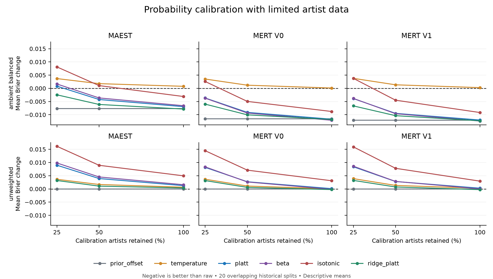

# 换几批校准样本，结论还成立吗？

这轮优化了研究的验证方式和运行流程。原音乐应用、模型参数和第一轮结果都没有改动。

上次每个历史划分只抽了一批校准艺人。这次在开始计算前固定5批新的抽样，逐批运行
全部7种方法，检查结论是否依赖“刚好抽到了哪些歌”。没有挑选表现最好的一批。

## 做了多少检验

- 共运行1,800组条件，覆盖1,320个不同的模型与校准样本组合。
- 25%和50%预算各换5批样本；100%预算样本相同，重复运行用于检查计算一致性，
  汇总时只计一次，不能当成5份独立证据。
- 每批都有20组历史划分、3种音频表征、2种训练权重；所有方法使用相同的评分歌曲。
- 5批均通过独立数值核查；相同输入的全预算结果完全一致，也复现了原报告。
- 汇总也经过独立重算：2,520行划分结果、126个条件均值和1,440行力度稳定性记录
  均核对通过，最大数值差约4.44×10⁻¹⁶。

## 结果意味着什么

**“少改一点”仍然比普通校准稳，但“校准一定有帮助”仍然不成立。**

在3种表征×2种权重×3种预算构成的18个条件中，受约束的Platt校准平均误差仍全部
低于普通Platt。不过，不加权的模型在25%和50%预算下，三种表征的平均误差仍高于
不调整。这里比较的是概率误差，不是分类准确率；条件也不是18份独立数据。

**一次抽样确实可能给人过于乐观的印象。** 例如，MAEST、氛围标签加权、25%预算下，
20组历史划分中有15组出现了“换一批校准艺人后，从改善变成变差，或反过来”的情况。
把预算提高到50%时，该数字降到2组。这说明平均结果有改善，不代表每批样本都有效。

| MAEST条件 | 校准艺人比例 | 相对原始分数的平均误差变化 | 5次抽样中出现好坏翻转的划分 |
|---|---:|---:|---:|
| 氛围标签加权 | 25% | -0.002458 | 15/20 |
| 氛围标签加权 | 50% | -0.006109 | 2/20 |
| 全部不加权 | 25% | +0.003186 | 7/20 |
| 全部不加权 | 50% | +0.001061 | 13/20 |

负数代表误差下降，正数代表误差上升。这些数值不是准确率的百分点变化。

校准力度的选择也敏感：960个小预算逐标签条件中，有870个在5次抽样里选择了不同
的力度。该数字是选择过程的稳定性诊断，不能当作未来失败概率。

图中25%和50%的值先在每个划分内平均5次，再平均20组历史划分。100%结果只计一次。
曲线不是置信区间，20组划分也不是互不相关的20份数据。

## 运行上的改进

现在安装依赖后，一条命令即可完成数据检查、实验、报告和独立验算。
由该脚本运行的实验若正常留下中断状态，下次会保留原记录、只补跑未完成部分；
不会删除表现差的结果或悄悄忽略程序错误。损坏的状态文件仍会保留并报错。
还加入了跨平台自动复现，以及新报告与已发布数字之间的逐项核对。

## 仍然没有解决什么

这5批样本都来自以前使用过的1,206首歌，不是新歌验证。艺人子集变化时，按照同一
规则分配的交叉验证折也可能变化；本实验没有单独分离这两种影响。已有标签可能
遗漏，艺人别名和音频模型预训练是否见过这些歌也无法完全排除。

本轮没有调整方法、超参数或应用模型。最终拟合没有回退；去除重复全预算记录后，
内部交叉验证有260次显式回退，其中被选中力度对应41次，全部计入结果。

下一项有价值的工作是先固定一个候选校准方案和通过标准，再自动获取未参与选择的
歌曲进行确认。无需用户听歌也能进行来源标签上的检验，但不能将这种标签冒充人工真值。

完整记录见[英文报告](REPORT.md)、[全部条件汇总](summary_cells.csv)、
[每个划分的抽样波动](within_split.csv)、[校准力度变化](ridge_stability.csv)、
[独立汇总核查](independent_aggregation_check.json)。
